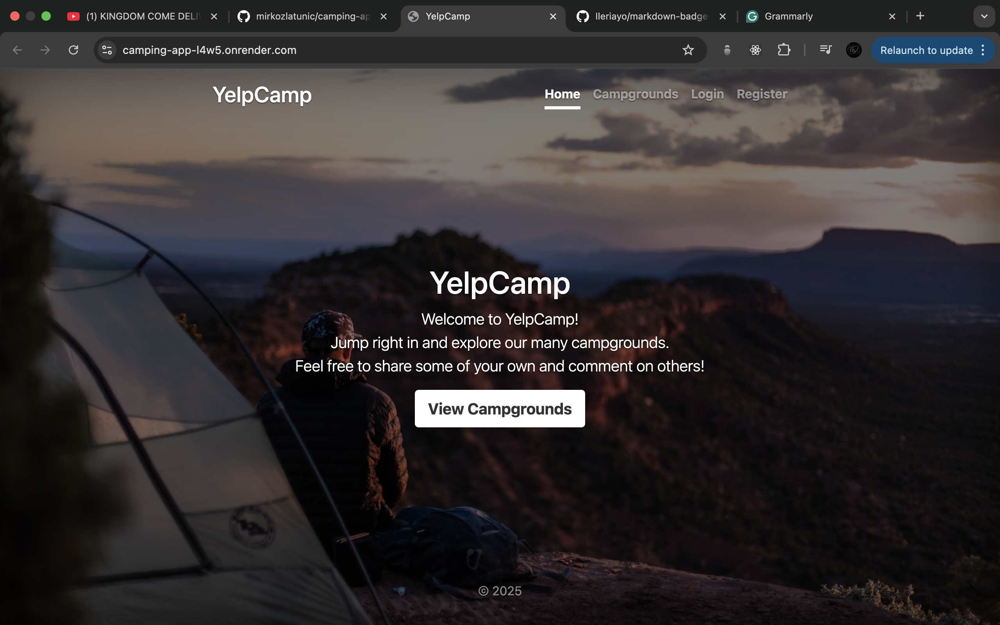
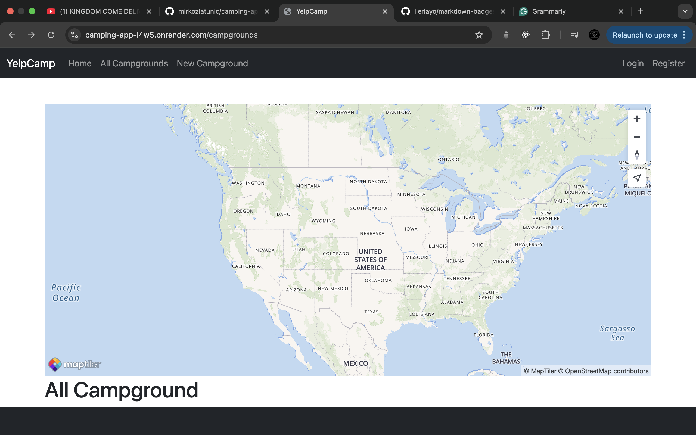
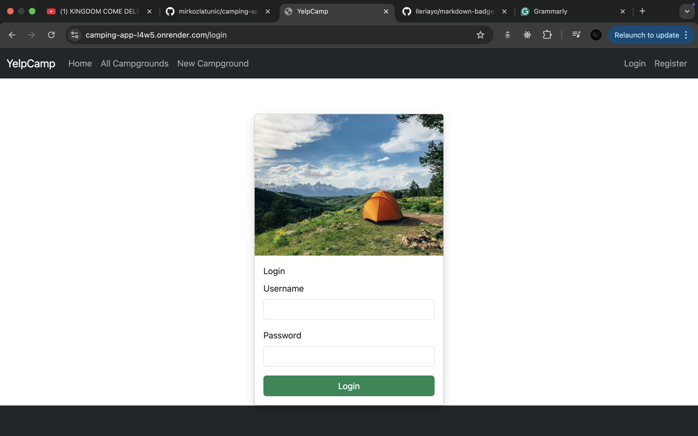
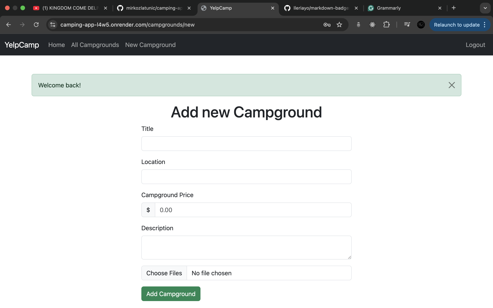

<h1>Campgin App</h1>

## 📋 <a name="table">Table of Contents</a>

1. 🤖 [Introduction](#introduction)
2. ⚙️ [Tech Stack](#tech-stack)
3. 🔋 [Link to Page](#link-page)
4. 🛠️ [Improvements Ideas](#improvements)

## <a name="introduction">🤖 Introduction</a>

This is an inspiring full-stack camping application designed to empower you to create and share your favorite campgrounds based on your unique experiences. Built with JavaScript and EJS, it utilizes MongoDB for a robust backend and harnesses the power of Render as its hosting platform. I created this site to reconnect with the fundamentals and embrace a new tool, EJS, on my journey of growth.

## <a name="tech-stack">⚙️ Tech Stack</a>

- HTML
- CSS
- JavaScript
- EJS
- MongoDB
- Render

## <a name="link-page">🔋 Link to Page</a>

- Live Site URL: [Render Page](https://camping-app-l4w5.onrender.com/)

## <a name="improvements">🛠️ Improvements Ideas</a>
